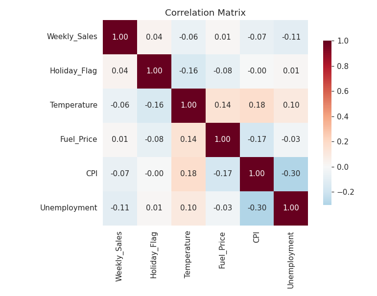
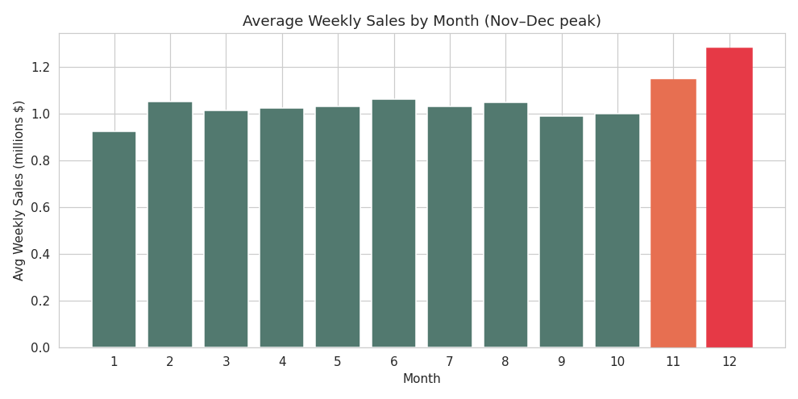
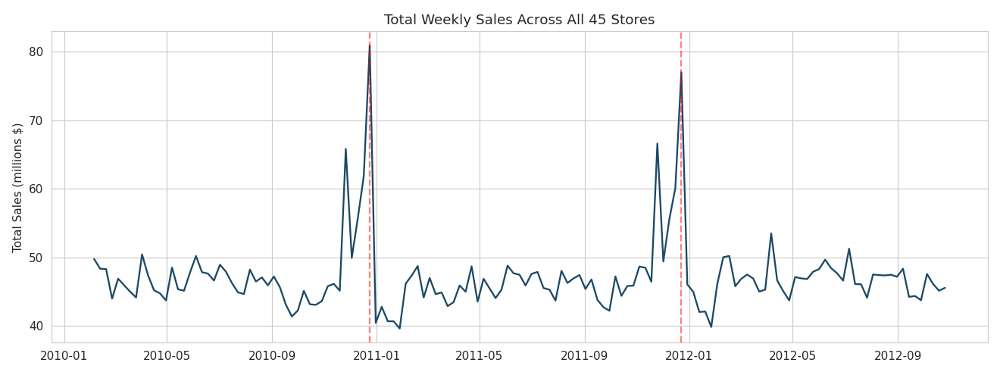
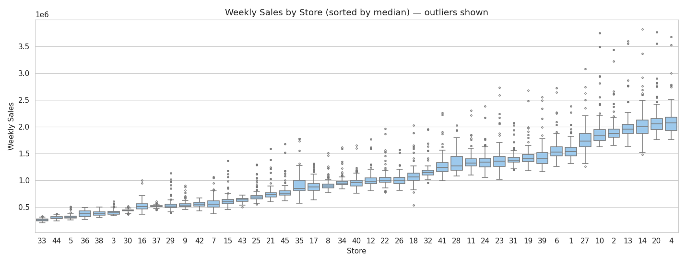
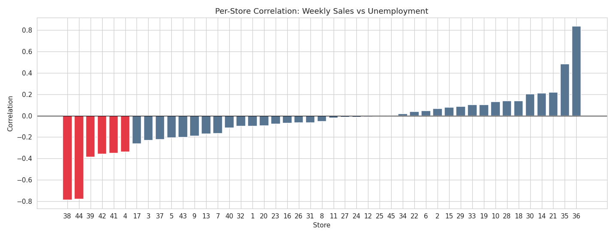
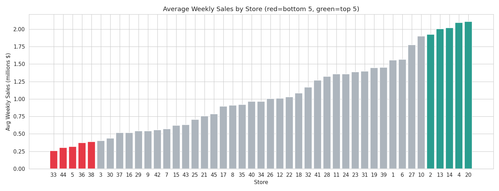
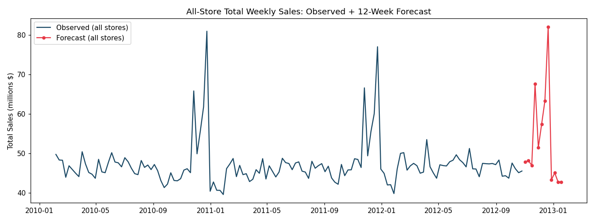
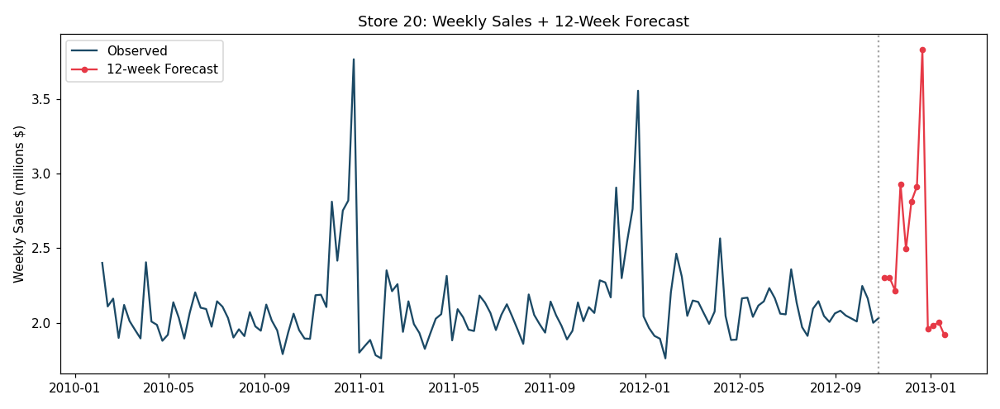

<div align="center">


# 🛒 Walmart Sales Analysis & Forecasting

#### Exploratory Data Analysis · Statistical Insights · 12‑Week Time‑Series Forecasting

*Data Science Capstone Project — Intellipaat (Problem Statement 1)*

<br/>

<!-- Tech stack -->


<!-- Repo stats -->


<br/>

<!-- Action buttons -->
[](https://colab.research.google.com/github/AnkitSaxena-AI/walmart-sales-forecasting/blob/main/Walmart_Capstone_Solution.ipynb)
[](Walmart_Capstone_Solution.ipynb)
[-EC1C24?style=for-the-badge&logo=adobeacrobatreader&logoColor=white)](reports/Walmart_Capstone_Report.pdf)
[-217346?style=for-the-badge&logo=microsoftexcel&logoColor=white)](walmart_12week_forecast.csv)

</div>

---

## 📑 Table of Contents

<a id="toc"></a>

- [🎯 Overview](#overview)
- [🧩 Problem Statement](#problem-statement)
- [🗃️ Dataset](#dataset)
- [🛠️ Tech Stack](#tech-stack)
- [🗂️ Project Structure](#project-structure)
- [📊 Exploratory Data Analysis](#eda)
- [🔍 Insights & Findings](#insights)
- [🔮 Forecasting the Next 12 Weeks](#forecasting)
- [🚀 Getting Started](#getting-started)
- [📁 Output Files](#outputs)
- [👤 Author](#author)
- [🙏 Acknowledgements](#acknowledgements)
- [📄 License](#license)

---

<a id="overview"></a>

## 🎯 Overview

A retail chain with **45 outlets** is struggling to match inventory **supply with demand**. This project turns **three years of weekly sales data** (Feb 2010 → Oct 2012) into clear business insight, then builds a model that **forecasts demand for every store over the next 12 weeks** so inventory can be planned ahead.

> **TL;DR** — Sales are driven overwhelmingly by the **calendar** (a huge Nov–Dec holiday peak), not by weather or fuel price. Macro factors like unemployment and CPI matter only for **specific stores**. A per‑store **Holt‑Winters** model forecasts the next 12 weeks with a backtested **~4.3% error (MAPE)**.

### ⭐ Key Results at a Glance

| Aspect | Finding |
|---|---|
| 🏆 **Top store** | **Store 20** — ≈ **$301M** total (≈ $2.11M/week) |
| 📉 **Weakest store** | **Store 33** — ≈ $37M; the best store sells **8.1× more** (statistically significant, p ≈ 3.5e‑121) |
| 📅 **Seasonality** | Strong **November–December** peak (Thanksgiving + Christmas) |
| 👷 **Unemployment** | Weak overall (**−0.11**); hits **Stores 38 & 44** hardest |
| 🛍️ **CPI** | Weak overall (**−0.07**); strong for **Stores 36, 35, 14** |
| 🌡️ **Temperature** | Negligible (**−0.06**) |
| 🔮 **Forecast model** | **Holt‑Winters** — **4.3%** mean MAPE (12‑week backtest), beats baseline on 42/45 stores |

---

<a id="problem-statement"></a>

## 🧩 Problem Statement

Using statistical analysis, EDA, outlier analysis and missing‑value handling, answer six business questions and forecast future demand:

1. Do **weekly sales depend on the unemployment rate** — and which stores suffer most?
2. Do sales show a **seasonal trend** — when, and why?
3. Does **temperature** affect weekly sales?
4. How does the **Consumer Price Index (CPI)** affect sales?
5. Which are the **top‑performing stores**?
6. Which is the **worst‑performing store**, and how big is the gap vs the best?
7. **Forecast** weekly sales for **each store for the next 12 weeks**.

---

<a id="dataset"></a>

## 🗃️ Dataset

`Walmart DataSet.csv` — **6,435 rows × 8 columns** · **45 stores** · **143 weekly periods** (5 Feb 2010 → 26 Oct 2012) · **no missing values**.

| Column | Description |
|---|---|
| `Store` | Store number (1–45) |
| `Date` | Week of sales (weekly, ending Friday) |
| `Weekly_Sales` | Sales for that store in that week (USD) |
| `Holiday_Flag` | 1 if the week contains a major holiday, else 0 |
| `Temperature` | Average regional temperature (°F) |
| `Fuel_Price` | Regional fuel cost (USD/gallon) |
| `CPI` | Consumer Price Index |
| `Unemployment` | Regional unemployment rate (%) |

---

<a id="tech-stack"></a>

## 🛠️ Tech Stack

| Purpose | Library |
|---|---|
| Data wrangling | **pandas**, **NumPy** |
| Statistics | **SciPy** (`scipy.stats`) |
| Visualization | **Matplotlib**, **seaborn** |
| Time‑series modelling | **statsmodels** (Holt‑Winters / seasonal decomposition) |
| Environment | **Jupyter Notebook** |

---

<a id="project-structure"></a>

## 🗂️ Project Structure

```text
walmart-sales-forecasting/
├── Walmart_Capstone_Solution.ipynb   # 📓 Full analysis + modelling notebook (runnable)
├── Walmart DataSet.csv               # 🗃️ Source data (45 stores × 143 weeks)
├── walmart_12week_forecast.csv       # 🔮 540 forecasts (45 stores × 12 weeks) + 95% bands
├── forecast_accuracy_by_store.csv    # 🎯 Per-store backtest accuracy (MAPE)
├── requirements.txt                  # 📦 Python dependencies
├── LICENSE                           # 📄 MIT
├── reports/
│   ├── Walmart_Capstone_Report.docx  # 📝 Full written report
│   └── Walmart_Capstone_Report.pdf
└── assets/                           # 🖼️ Charts used in this README
```

---

<a id="eda"></a>

## 📊 Exploratory Data Analysis

Weekly sales are **right‑skewed** (a long tail of large holiday weeks). Pooled across all stores, **every external driver correlates only weakly** with sales — the calendar matters far more than economics or weather.

<table>
<tr>
<td width="50%"></td>
<td width="50%"></td>
</tr>
</table>

<p align="center"></p>

<details>
<summary>📦 <b>Outlier analysis</b> (click to expand)</summary>

<br/>

Only **34 rows (0.53%)** fall outside the IQR fence, and the most extreme are all **Thanksgiving and Christmas weeks** — genuine seasonal peaks, **not errors**, so they were retained.

<p align="center"></p>
</details>

---

<a id="insights"></a>

## 🔍 Insights & Findings

### (a) 👷 Unemployment — weak overall, brutal for a few stores
Pooled correlation is just **−0.11**, but it's highly store‑specific: **Store 38 (−0.79)** and **Store 44 (−0.78)** are extremely sensitive, followed by 39, 42, 41 and 4. Protect these during downturns.

<p align="center"></p>

### (b) 📅 Seasonality — a strong Nov–Dec peak
Sales sit near **$45–48M/week** chain‑wide for most of the year, then spike every **November–December** (Thanksgiving / Black Friday + Christmas). Holiday weeks average significantly higher than normal weeks (**$1.12M vs $1.04M**, p = 0.008).

### (c) 🌡️ Temperature — no meaningful effect
Correlation **−0.06**; average sales are essentially flat across temperature bands.

### (d) 🛍️ CPI — a store‑level factor
Weak overall (**−0.07**) but strong for price‑sensitive **Store 36 (−0.92)**, **Store 35 (−0.42)** and **Store 14 (−0.42)**.

### (e) 🏆 Top‑performing stores
**Store 20, 4, 14, 13, 2** — Store 20 leads with ≈ **$301M** total sales.

### (f) 📉 Worst store & the gap
**Store 33** is weakest (≈ $37M). The best store (20) sells **~8.1× more** — a difference of ≈ $264M that a Welch t‑test confirms is **highly significant** (p ≈ 3.5e‑121), i.e. a real structural difference in size/format/location.

<p align="center"></p>

---

<a id="forecasting"></a>

## 🔮 Forecasting the Next 12 Weeks

Each store is modelled as its own weekly time series with a **52‑week seasonal cycle** using **Holt‑Winters Exponential Smoothing** (additive trend + additive seasonality). The forecast horizon (Nov 2012 → Jan 2013) includes the holiday peak — so capturing seasonality is essential.

**Validation** — the last 12 weeks of each store were held out and predicted:

| Model | Mean MAPE | Median MAPE |
|---|:---:|:---:|
| **Holt‑Winters** (chosen) | **4.33%** | **3.01%** |
| Seasonal‑naïve (baseline) | 8.77% | 7.14% |

Holt‑Winters more than halves the baseline error and wins on **42 of 45 stores**. Final forecasts for all 45 stores (540 rows, with 95% confidence bands) are in [`walmart_12week_forecast.csv`](walmart_12week_forecast.csv).

<p align="center"></p>
<p align="center"></p>

---

<a id="getting-started"></a>

## 🚀 Getting Started

```bash
# 1. Clone the repository
git clone https://github.com/AnkitSaxena-AI/walmart-sales-forecasting.git
cd walmart-sales-forecasting

# 2. (Optional) create a virtual environment
python -m venv .venv
source .venv/bin/activate        # Windows: .venv\Scripts\activate

# 3. Install dependencies
pip install -r requirements.txt

# 4. Launch the notebook
jupyter notebook Walmart_Capstone_Solution.ipynb
```

Or run it instantly in the cloud — no setup required:

[](https://colab.research.google.com/github/AnkitSaxena-AI/walmart-sales-forecasting/blob/main/Walmart_Capstone_Solution.ipynb)

---

<a id="outputs"></a>

## 📁 Output Files

| File | What's inside |
|---|---|
| [`Walmart_Capstone_Solution.ipynb`](Walmart_Capstone_Solution.ipynb) | End‑to‑end analysis: cleaning → EDA → insights → forecasting |
| [`walmart_12week_forecast.csv`](walmart_12week_forecast.csv) | 540 forecasts (45 stores × 12 weeks) with `Lower_95` / `Upper_95` bands |
| [`forecast_accuracy_by_store.csv`](forecast_accuracy_by_store.csv) | Backtest MAPE for each store |
| [`reports/Walmart_Capstone_Report.pdf`](reports/Walmart_Capstone_Report.pdf) | Full written report with figures & tables |

---

<a id="author"></a>

## 👤 Author

**Ankit Saxena**

[](https://github.com/AnkitSaxena-AI)
[](mailto:gungunsaxena.0001@gmail.com)

> 💡 If you found this project useful or interesting, please consider giving it a ⭐ — it helps a lot!

---

<a id="acknowledgements"></a>

## 🙏 Acknowledgements

- **Intellipaat** — Data Science capstone (Problem Statement 1)
- Dataset: Walmart weekly store sales (a widely used public retail‑forecasting dataset)

---

<a id="license"></a>

## 📄 License

Released under the **MIT License** — see [`LICENSE`](LICENSE) for details.

<div align="center">

---

*Built with pandas, statsmodels & matplotlib · © 2026 Ankit Saxena*

[⬆ Back to top](#toc)

</div>
